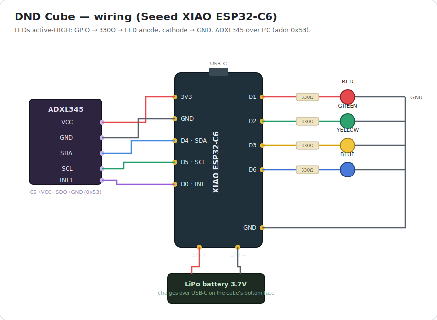

# dnd_box — DND status cube

A battery-powered "Do Not Disturb" cube built on a **Seeed XIAO ESP32-C6**. An
**ADXL345** accelerometer senses which face points **up**, and the matching colored
LED lights to show your status:

| Face up | LED | Meaning |
| ------- | --- | ------- |
| Front   | 🔴 Red    | Busy / do not disturb |
| Left    | 🟢 Green  | Available |
| Right   | 🟡 Yellow | Semi-Available |
| Back    | 🔵 Blue   | Who knows |
| Top     | — (off)   | Idle / off |
| Bottom  | — (off)   | Charge side (USB-C port) |

Only one LED is lit at a time. Charging is independent of status — the cube keeps
showing the orientation color while plugged in. After sitting idle on an off side for
30 s it **deep-sleeps** and **wakes on movement** (ADXL345 activity interrupt → D0).

## Wiring



LEDs are **active-HIGH**: `GPIO → 330Ω → LED anode`, `LED cathode → GND`. The ADXL345
runs in I²C mode — tie its `CS→VCC` and `SDO→GND` (address `0x53`); most breakouts do
this already.

| From (XIAO) | GPIO | To |
| ----------- | ---- | -- |
| D7  | 17 | 330Ω → Red LED → GND |
| D8  | 19 | 330Ω → Green LED → GND |
| D9  | 20 | 330Ω → Yellow LED → GND |
| D10 | 18 | 330Ω → Blue LED → GND |
| D4 · SDA | 22 | ADXL345 SDA |
| D5 · SCL | 23 | ADXL345 SCL |
| D0 · INT | 0  | ADXL345 INT1 (must be an LP GPIO for deep-sleep wake) |
| 3V3 | — | ADXL345 VCC (+ CS) |
| GND | — | ADXL345 GND (+ SDO), LED cathodes |
| BAT+ / BAT− | — | LiPo battery (charges via USB-C) |

## One-time setup

```sh
./setup.sh
```

Installs `arduino-cli` (Homebrew), the Espressif `esp32` core, and confirms the board.

## Calibrate

Every cube's "up" vectors differ, so record them once:

```sh
./upload.sh calibrate -m
```

Follow the serial prompts — for each side, rotate so that face is **up**, hold still,
and press **Enter**. At the end it prints a `config.h` block. Copy it over
`firmware/config.h` (replacing the placeholder), then flash the app.

## Run

```sh
./upload.sh -m
```

Builds and flashes `firmware/`, then opens the serial monitor (115200). You'll see
`side = RED`, `side = GREEN`, … as you turn the cube, with the matching LED lit.

## Tuning

In `firmware/firmware.ino`:

- `SLEEP_TIMEOUT_MS` — idle time on an off side before deep sleep (default 30 s).
- `MATCH_MIN_CONF` — how square-on a face must be to register (dot product, 0.90).
- `DEBOUNCE` — stable reads before switching sides (anti-flicker).

Wake sensitivity is `ACT_THRESH` in `libraries/DndBox/DndBox.h` (62.5 mg/LSB).

## Troubleshooting

- **All LEDs flashing on boot** → ADXL345 not detected. Check SDA/SCL/power and that
  `CS→VCC`, `SDO→GND`.
- **"Resource busy" / could not open port** → a serial monitor is still holding the
  port. Press **Ctrl-C** in the monitor to exit before re-uploading. (`upload.sh` also
  auto-closes anything holding the port before it flashes.)
- **Port not found** → `arduino-cli board list` shows the current `/dev/cu.usbmodem*`.
- **Upload won't start** → hold **BOOT**, tap **RESET**, release **BOOT**, re-run.

## Enclosure (3D print)

A parametric OpenSCAD model lives in `enclosure/` — a hollow cube shell plus a
friction-fit lid, with 5 mm LED holders (behind thin diffuser windows) on the four
side walls, wire channels down each wall, protoboard standoffs, and a USB-C cutout.

- `enclosure/dnd_cube.scad` — the model. Everything is a variable at the top (cube
  size, wall/diffuser thickness, LED size, board size, standoff height, USB position…).
- `enclosure/dnd_cube_shell.stl`, `dnd_cube_lid.stl` — ready-to-slice exports of the
  defaults (50 mm cube, 5 mm LEDs, 2 mm walls).

Regenerate STLs after editing:

```sh
openscad -o enclosure/dnd_cube_shell.stl -D 'part="shell"' enclosure/dnd_cube.scad
openscad -o enclosure/dnd_cube_lid.stl   -D 'part="lid"'   enclosure/dnd_cube.scad
```

**Printing**
- Shell prints as-is (open side up). Print the **lid upside-down** (skirt pointing up).
- Print the shell in **translucent/white** filament, or thin the `diffuser` variable,
  so the LEDs glow the face instead of showing a hot dot.
- Tune `fit` (skirt clearance) to your printer if the lid is too loose/tight.

**Assembly**
1. Screw the protoboard to the four standoffs (M2.5 self-tappers into the pilot holes).
2. Mount the XIAO with its USB-C at the cutout wall — nudge `board_cx`/`usb_angle` so the
   port lines up; wire the LEDs on flying leads into the holders (nose against the
   diffuser). Chain one **common ground** across all four LED cathodes to save wires.
3. Anchor the LED wires where they leave the board (strain relief), then tuck them in
   the channels.
4. Close the lid, then **calibrate** (`./upload.sh calibrate`) — do it last, since the
   mapping depends on the ADXL345's final mounted orientation.

## Layout

| Path | Purpose |
| ---- | ------- |
| `firmware/firmware.ino` | Cube app: orientation → LED, sleep/wake |
| `enclosure/dnd_cube.scad` | Parametric 3D-print model (+ exported STLs) |
| `firmware/config.h` | Calibration data (generated by the calibrate tool) |
| `calibrate/calibrate.ino` | Walks each side, emits a `config.h` block |
| `component_tests/` | Standalone sketches to exercise one component in isolation |
| `libraries/DndBox/DndBox.h` | Pin map, ADXL345 driver, orientation match, sleep |
| `setup.sh` | One-time toolchain + core install |
| `upload.sh` | `./upload.sh [firmware\|calibrate\|<component_test>] [port] [-m]` |
| `wiring.svg` | The diagram above |
| `bin/python` | Shim so build tools find `python` |
